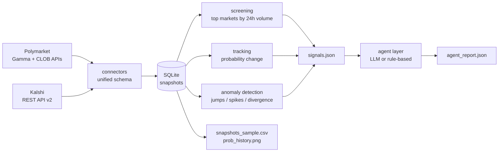

# Prediction Market Analytics

Data-ingestion + analysis framework for **Polymarket** and **Kalshi** prediction
markets: unified real-time market data, probability tracking, transparent
anomaly detection, and an LLM analyst layer that turns raw signals into a
structured trading-desk view. Built as an end-to-end reference pipeline —
public APIs only, read-only, no trading.

## Architecture



**Data flow:** both platforms are polled on a schedule; every poll writes
timestamped snapshots into one append-only SQLite table. The analysis pass
screens the highest-volume markets, computes probability changes over trailing
windows, runs three anomaly detectors over the stored history, and hands a
compact JSON context to the agent layer, which returns a structured report.

## Quickstart

```bash
pip install -r requirements.txt

cp .env.example .env          # keys are all optional, see below

# 1) seed ~1 week of probability history for the top Polymarket markets
python scripts/backfill_polymarket.py --top 10 --interval 1w --fidelity 30

# 2) live snapshots every 5 minutes
python scripts/snapshot_loop.py --interval 300 --cycles 12

# 3) screening + tracking + anomalies + agent report -> outputs/
python scripts/run_analysis.py

# tests
pytest tests/ -q
```

### No VPN? Run collection in the cloud (recommended)

Polymarket and Kalshi are not directly reachable from some networks. This
repository ships a GitHub Actions workflow
([.github/workflows/collect.yml](.github/workflows/collect.yml)) that runs
**on GitHub-hosted runners outside mainland China** — no local proxy needed:

1. Push this repository to GitHub and enable Actions.
2. Trigger the **collect-and-analyze** workflow once via
   *Actions → Run workflow → Backfill = true*. The first run seeds ~1 week of
   Polymarket probability history, collects a live snapshot, runs the full
   analysis, and commits real artifacts into `outputs/`.
3. After that it runs **hourly on a schedule**, appending snapshots to a
   cache-persisted SQLite database and refreshing all outputs automatically.
4. `git pull` locally whenever you want to inspect the latest results.

Optional repository secrets (*Settings → Secrets and variables → Actions*):

| Secret | Effect |
|---|---|
| `OPENAI_API_KEY` | use the LLM analyst (DeepSeek endpoint; reachable from China) instead of the rule-based fallback |
| `KALSHI_API_KEY_ID` + `KALSHI_PRIVATE_KEY` | enable Kalshi collection (PEM body of the RSA key) — otherwise Polymarket-only |

**Local network note:** requests honor standard `HTTP(S)_PROXY` environment
variables; if you do have a local proxy, set e.g.
`HTTPS_PROXY=http://127.0.0.1:7897` in `.env` and run the scripts directly.

**Credentials (all optional):**

| Platform | Auth | Without credentials |
|---|---|---|
| Polymarket (Gamma discovery + CLOB price history) | none for public reads | works |
| Kalshi REST API | RSA-PSS signed requests | pipeline **skips Kalshi** and runs on Polymarket only |
| LLM analyst | any OpenAI-compatible endpoint (default DeepSeek) | deterministic **rule-based** analyst is used |

## Unified data schema

Every connector normalizes its platform into this snapshot record
(`src/pma/models.py`):

| Field | Type | Description |
|---|---|---|
| `ts` | str | UTC ISO-8601 observation time (`2026-10-04T08:00:00Z`) |
| `platform` | str | `polymarket` \| `kalshi` |
| `market_id` | str | native id (gamma market id / Kalshi ticker) |
| `question` | str | market question text |
| `prob` | float | implied YES probability in [0, 1] |
| `bid` / `ask` | float? | best YES quotes (prob units) |
| `volume_24h` | float? | USD-equivalent 24h volume |
| `volume_native` | float? | native units (contracts) |
| `liquidity` | float? | USD |
| `end_date` | str? | market close time |

Probability convention: Polymarket YES price (Gamma); Kalshi last trade price,
else mid of `yes_bid`/`yes_ask`, in cents / 100. Kalshi USD volume is
approximated as `contracts_24h x price` (each contract pays $1 at settlement).

Storage: `snapshots(ts, platform, market_id, question, prob, bid, ask,
volume_24h, volume_native, liquidity, end_date)` — append-only, keyed by
`(ts, platform, market_id)`, indexed for per-market time-series queries.

## Analysis framework

1. **Screening** (`analysis/screening.py`) — keep markets with 24h volume
   above a floor (default $10k), rank descending, take top N (default 15 per
   platform). Volume is used as a transparent proxy for attention/liquidity.
2. **Tracking** (`analysis/tracking.py`) — per market, probability now vs. 1h
   and 24h ago, computed from the snapshot history in SQLite.
3. **Anomaly detection** (`analysis/anomaly.py`) — three explainable,
   rule-based detectors (no black boxes):

| Detector | Logic | Default threshold |
|---|---|---|
| `prob_jump` | \|Δprob\| between consecutive observations | ≥ 5pp (rolling z-score attached as context) |
| `volume_spike` | 24h volume ≥ ratio × rolling baseline **and** absolute increase ≥ floor | ratio 1.5×, +$5k |
| `divergence` | same event priced on both platforms differs | ≥ 8pp (events matched by question-text Jaccard ≥ 0.55, precision over recall) |

All thresholds live in `pma.config.Config` — one place to tune.

## Agent layer

`src/pma/agent.py` feeds a compact JSON context (tracked markets + signals)
to an analyst prompt and requires **strict JSON** back:

```json
{
  "engine": "llm:deepseek-chat",
  "summary": "...",
  "markets": [
    {
      "platform": "polymarket",
      "market_id": "12345",
      "question": "Will the Fed hold rates in March?",
      "signals": ["prob_jump", "volume_spike"],
      "interpretation": "A 9pp move within 30 minutes alongside a volume spike suggests new information...",
      "confidence": "medium",
      "suggested_action": "investigate"
    }
  ]
}
```

Two engines share this contract: an LLM (OpenAI-compatible API, DeepSeek by
default, `temperature=0.2`) and a deterministic **rule-based fallback** that
always produces a report when no key is configured or the call fails — the
pipeline never hard-fails on the analyst layer.

## Sample outputs

Produced by `scripts/run_analysis.py` into `outputs/` (from a live run —
see files in this repository):

- `signals.json` — ranked anomaly signals with full context
- `agent_report.json` — analyst interpretation per flagged market
- `prob_history.png` — implied-probability history of the watched markets
- `snapshots_sample.csv` — latest unified snapshot per market

## Project structure

```
├── scripts/
│   ├── backfill_polymarket.py   # seed history from CLOB prices-history
│   ├── snapshot_loop.py         # scheduled ingestion (--once / --interval)
│   └── run_analysis.py          # screening + tracking + anomalies + agent
├── src/pma/
│   ├── connectors/              # polymarket.py, kalshi.py, base HTTP plumbing
│   ├── analysis/                # screening.py, tracking.py, anomaly.py
│   ├── agent.py                 # LLM analyst + rule-based fallback
│   ├── config.py                # all thresholds, env-overridable
│   ├── models.py                # unified MarketSnapshot
│   ├── pipeline.py              # orchestration
│   └── storage.py               # SQLite snapshot store
├── tests/                       # unit tests for analysis + matching
├── outputs/                     # generated artifacts
└── resume/                      # candidate resume
```

## Design notes & limitations

- **Read-only, public data.** No order placement, no wallet, no scraping.
- **Kalshi volume** is USD-approximated; a fee-aware conversion would need
  trade-level data.
- **Cross-platform matching** uses conservative question-text similarity; a
  production system would maintain a curated event mapping.
- **History depth**: the CLOB backfill provides 1 week at 30-min resolution;
  longer spans need a scheduled collector (the snapshot loop).
- The agent layer interprets signals; it does not place trades or size
  positions.
